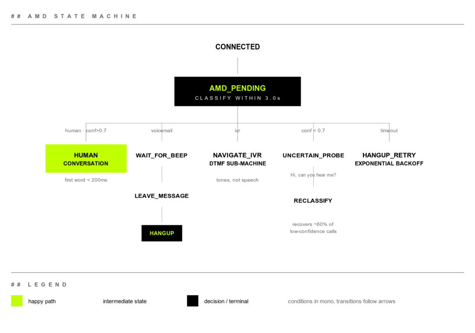
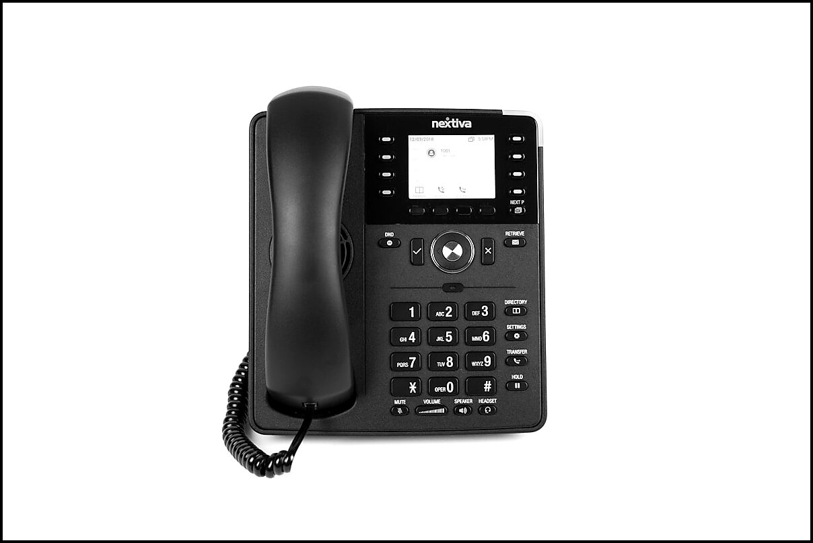

Yesterday LiveKit shipped Agents 1.5.9. Buried in the release notes, between a Deepgram redaction parameter and a `WarmTransferTask` DTMF fix, is the line that matters for anyone running outbound voice agents:

**Answering Machine Detection (AMD) is now built in.**

Until this release, if you placed outbound calls and wanted to know whether you reached a human, a voicemail box, or an IVR menu, you wrote it yourself. We did. Two other teams I traded notes with last year did too. Now it's a primitive.

The classifier is the easy part. The state machine you build around it is where the work lives.

### Outbound is not inbound, flipped backwards

When someone calls your business, the moment the call connects you know exactly one thing. There's a human on the other end and they want something. The agent starts talking.

When your agent calls someone, the moment the call connects you know nothing. The line might be:

- A human ("Hello?")
- A voicemail box ("Hi, you've reached Bob. Please leave a message after the beep.")
- An IVR menu ("Press 1 for sales, 2 for support...")
- A network situation that connected but no one actually answered

Each one needs its own agent behavior. Talk to voicemail as if it's a human and the message goes nowhere, plus you've burned a callback. Greet a real human with a stiff voicemail script and you sound like a scam. Try to navigate an IVR by speaking when you should be sending DTMF tones, and you sit on hold forever.

The first second of an outbound call is the most expensive second. You have to classify before you commit to a behavior.


### What AMD actually emits

LiveKit's AMD model outputs one of three results per call:

- `human`: a person picked up
- `voicemail`: answering machine greeting
- `ivr`: automated menu, press-N-for-X tree

Plus a confidence score and the audio segment it classified on.

The classification happens in the first 1 to 3 seconds of audio after the connect. You don't get to wait. Every additional second of silence before the agent starts talking makes the human on the other end (if there is one) more confused and more likely to hang up.

### How 1.5.9 wires it up

The AMD result drops into `AgentSession` as a lifecycle event. The toy version looks like this:

```python
session = AgentSession(
    stt=...,
    llm=...,
    tts=...,
    amd=AMDOptions(
        enabled=True,
        timeout=3.0,
        confidence_threshold=0.7,
    ),
)

@session.on("amd_complete")
async def handle_amd(event):
    if event.result == "human":
        await session.say("Hi, this is the assistant calling about...")
    elif event.result == "voicemail":
        await wait_for_beep(session)
        await session.say(voicemail_script)
        await session.hangup()
    elif event.result == "ivr":
        await navigate_ivr(session, target_extension="2")
```

That works in a demo. In production, you'll spend most of your time on the parts that aren't in this code.

### The branches that look obvious aren't

Here's the shape we converged on after running outbound flows at scale:



For copy/paste:

```
CONNECTED
   │
   ▼
AMD_PENDING  (max 3.0s)
   │
   ├── human, conf > 0.7      → HUMAN_CONVERSATION
   │
   ├── voicemail               → WAIT_FOR_BEEP → LEAVE_MESSAGE → HANGUP
   │
   ├── ivr                     → NAVIGATE_IVR (DTMF state machine)
   │
   ├── conf < 0.7              → UNCERTAIN_PROBE
   │                                  │
   │                                  └── "Hello, is this <name>?" → reclassify
   │
   └── timeout                 → HANGUP_RETRY (back off, try again later)
```

Each branch has its own failure modes.

**HUMAN_CONVERSATION** wants the agent to start talking fast. We aim for under 200ms after the AMD event. Anything over 800ms reads as a robot or a bad connection, and people hang up. The rest of the pipeline burns through that budget: streaming TTS, prewarmed LLM context, and tool-call prefetching all have to be ready before the first word goes out.

**WAIT_FOR_BEEP** is where voicemail handling falls apart. Voicemail greetings vary from 5 to 25 seconds. You can't just start talking. You need a beep detector (energy plus frequency signature) running for as long as AMD result is `voicemail`. Get this wrong and your message starts mid-greeting, which sounds like a broken bot.

**LEAVE_MESSAGE** has tight constraints. Voicemail boxes cut off somewhere between 30 and 60 seconds, and voicemail-to-text systems will index whatever you say. Write the message so it reads cleanly in a transcript, then make sure it also sounds OK out loud. Write the script as if a transcription model is the first audience. Because one is.

**NAVIGATE_IVR** is a different state machine entirely. Once AMD says IVR, you're in DTMF land. Speech doesn't work, and the timing of digits matters. Some IVRs swallow digits sent during prompts. Others won't accept input until a beep. You need menu prompt recognition (small ASR model, not your main LLM) plus a digit-sequence emitter with per-vendor tuning.



**UNCERTAIN_PROBE** is the move when AMD comes back below threshold. Don't commit. Say something a human would respond to and a voicemail wouldn't. "Hi, can you hear me?" is a good probe because:

- A human says "yes" or "hello" within 1 to 2 seconds
- A voicemail keeps playing its scripted greeting, ignoring you
- An IVR ignores the question and continues its menu

You reclassify based on what comes back. This recovers about 60% of the low-confidence cases we'd otherwise have to hang up on.

### What you should actually measure

After you ship this, four metrics matter. None of them are "model accuracy."

**Detection latency, P50 and P95.** Time from `connect` to `amd_complete`. In our pre-1.5.9 system this was around 1.4s P50, 2.8s P95. LiveKit claims their model is faster. Measure it on your own audio. Every telephony stack adds different noise characteristics.

**Per-class false positive rate.** Don't track overall accuracy. "Voicemail when actually human" and "human when actually voicemail" carry different costs. In our outbound flows, mistaking a human for voicemail is worse: we play a recorded script at someone standing there confused, who then hangs up and remembers the brand as the one with the robot calls. Weight your scoring to your business.

**False-positive cost in dollars.** Pick a number for the cost of a wasted human contact. Multiply by FP rate. Pick a number for the cost of a confused real human (complaint, churn, lost sale). The model is good if it minimizes weighted FP cost, not raw accuracy.

**Time to first word after AMD.** If AMD says human, how fast does your agent actually say its first word? This is where the rest of your pipeline cost lives. If it's over 500ms, AMD is not your bottleneck.

### What 1.5.9 doesn't give you

Things production teams still build themselves:

**Carrier-specific voicemail patterns.** Verizon, AT&T, and T-Mobile voicemail systems each have their own greeting tempos and beep frequencies. A model trained on aggregate data is OK at all of them and best-in-class at none.

**Voicemail systems with no beep.** Some VoIP boxes say "leave your message after the beep" without an actual beep. Or they use a tone the model wasn't trained on. We've seen messages start before the box is ready, getting clipped mid-sentence.

**IVR navigation.** AMD tells you the call is an IVR. It does not help you navigate one. That's a separate speech-to-intent pipeline tuned for menu prompts, plus a DTMF emitter that knows when each carrier accepts digits.

**Real-time confidence updates.** AMD fires once with a single confidence score. In practice, you want the score to update as more audio arrives, because a 1.2-second greeting and a 4-second greeting carry very different signal. Right now you get one shot.

### If you're already on Agents 1.4 or older

A few moves before you flip the switch:

1. **Don't migrate everything yet.** AMD is opt-in. Wrap 5 to 10% of outbound calls with it and shadow-log the result alongside your current logic. Measure agreement before you replace your old detector.

2. **Build the state machine before you trust the classifier.** The classifier is the easy part. The branching logic for voicemail, IVR, and uncertain probes is where your time goes.

3. **Instrument detection latency before changing anything.** You want a baseline. Otherwise you can't tell whether the new model is actually faster or just newer.

4. **Write the voicemail script for transcription.** Because a transcription bot will read it before any human does.

The classifier is a primitive. The product is the state machine you build on top.
